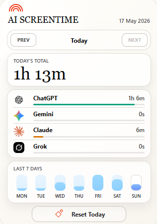
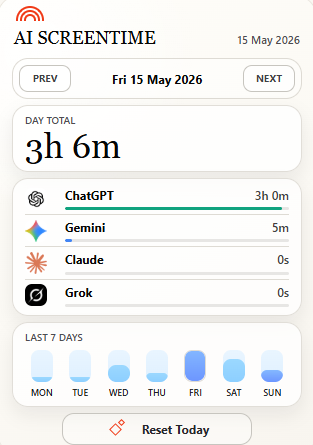
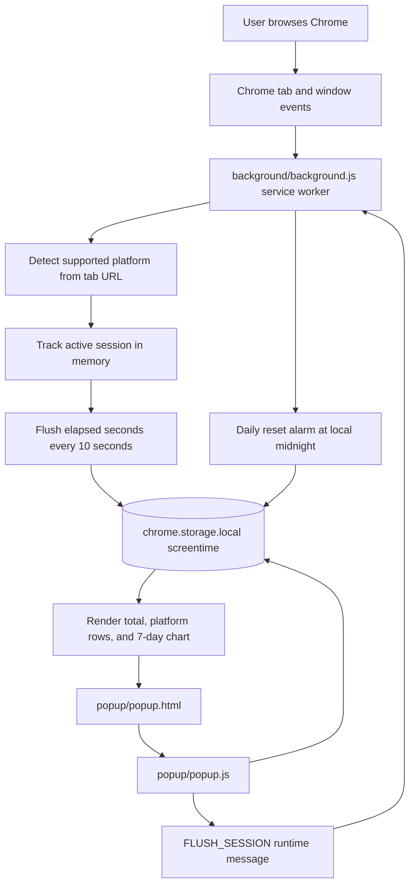

# AI Screentime

AI Screentime is a Manifest V3 Chrome extension that tracks active-tab time on AI chat platforms and shows a compact local dashboard in the browser popup. It currently supports ChatGPT, Gemini, Claude, and Grok.

The extension stores all data locally with `chrome.storage.local`. It does not send analytics, usage data, or personal information to any server.

## Screenshots

### Today



### Previous Day



## Features

- Tracks active time on supported AI platforms.
- Separates time by platform: ChatGPT, Gemini, Claude, and Grok.
- Shows the selected day total and per-platform breakdown.
- Lets you move between days in the stored 7-day window.
- Shows a compact 7-day activity chart.
- Flushes the live session before rendering the popup, so the displayed time is current when opened.
- Resets today's data with a confirmation prompt.
- Stores only the latest 7 days of history.
- Pauses tracking when the browser window loses focus or the user switches to an unsupported tab.
- Caps any single tracking write at 30 seconds to avoid runaway time after sleep or suspend.

## Supported Platforms

| Platform | Domains | Storage key | Accent |
|---|---|---|---|
| ChatGPT | `chatgpt.com`, `chat.openai.com` | `chatgpt` | `#10a37f` |
| Gemini | `gemini.google.com` | `gemini` | `#4285f4` |
| Claude | `claude.ai` | `claude` | `#d97706` |
| Grok | `grok.com`, `x.ai` | `grok` | `#6366f1` |

## Architecture



## Repository Structure

```text
.
|-- manifest.json
|-- background/
|   `-- background.js
|-- popup/
|   |-- popup.html
|   |-- popup.css
|   `-- popup.js
|-- content/
|   `-- content.js
|-- assets/
|   |-- chatgpt.png
|   |-- claude.png
|   |-- gemini.png
|   |-- grok.png
|   |-- today.png
|   |-- friday.png
|   `-- icons/
|       |-- icon16.png
|       |-- icon32.png
|       |-- icon48.png
|       `-- icon128.png
|-- AGENTS.md
`-- README.md
```

## Key Files

### `manifest.json`

Defines the Chrome extension shell:

- Uses Manifest V3.
- Registers `background/background.js` as the service worker.
- Registers `popup/popup.html` as the browser action popup.
- Requests only the permissions needed for tracking:
  - `tabs` to read the active tab URL.
  - `storage` to persist local screentime.
  - `alarms` to flush periodically and reset daily.
- Grants host access only to supported AI domains.

### `background/background.js`

Owns tracking. It listens to:

- `chrome.tabs.onActivated`
- `chrome.tabs.onUpdated`
- `chrome.windows.onFocusChanged`
- `chrome.alarms.onAlarm`
- `chrome.runtime.onMessage`

The background worker keeps one in-memory `activeSession`:

```js
{
  platformKey: "chatgpt",
  startTime: 1715930000000
}
```

When focus changes, it flushes the old session, detects the new platform, and starts a new session only if the active tab belongs to a supported domain.

### `popup/popup.html`

Provides the dashboard structure:

- Header with extension title and selected date.
- Previous/next day navigation.
- Daily total card.
- Per-platform usage list.
- 7-day chart.
- Reset button.

### `popup/popup.css`

Contains the full popup design. The popup is fixed to the compact Chrome-extension footprint:

- Width: `320px`
- Height: `460px`
- Warm off-white background.
- Rounded cards.
- Serif headline/total typography.
- Proportional platform logo frames.
- No scrolling required for the full dashboard.

### `popup/popup.js`

Owns dashboard rendering:

- Sends `FLUSH_SESSION` to the background worker before reading data.
- Reads `screentime` from `chrome.storage.local`.
- Renders the selected day, total time, platform rows, and weekly chart.
- Handles previous/next day navigation.
- Handles "Reset Today".

### `content/content.js`

Intentionally empty. Tracking is handled entirely by the background service worker. The content script is reserved for future page-level tracking if needed.

## Data Model

The extension stores data under the `screentime` key in `chrome.storage.local`.

```json
{
  "screentime": {
    "2026-05-17": {
      "chatgpt": 3240,
      "gemini": 0,
      "claude": 360,
      "grok": 0
    }
  }
}
```

Rules:

- Dates use local `YYYY-MM-DD` keys from `toLocaleDateString("en-CA")`.
- Values are seconds.
- Missing or invalid platform values are normalized to `0`.
- Only the latest 7 days are kept.
- Today can be reset from the popup without deleting previous days.

## Tracking Flow

1. The user opens or switches to a tab.
2. The background service worker receives a tab/window event.
3. The current active session is flushed to storage.
4. The new tab URL is checked against the platform config.
5. If the URL matches a supported platform, a new session starts.
6. A `flush` alarm writes elapsed time every 10 seconds.
7. When the popup opens, it requests one more flush before rendering.

## Installing Locally

1. Open Chrome.
2. Go to `chrome://extensions`.
3. Enable Developer Mode.
4. Click "Load unpacked".
5. Select this repository folder.
6. Pin "AI Screentime" to the toolbar if desired.

## Usage

1. Open one of the supported AI sites.
2. Keep the tab active while using it.
3. Open the extension popup to view the latest total.
4. Use `Prev` and `Next` to inspect other stored days.
5. Click a bar in the weekly chart to jump to that day.
6. Use `Reset Today` to clear only today's data.

## Development Notes

- The platform configuration is duplicated in `background/background.js` and `popup/popup.js` so both scripts can run independently in the MV3 extension environment.
- The extension avoids remote APIs and build tooling.
- All UI assets are local files in `assets/`.
- Platform logos are rendered from:
  - `assets/chatgpt.png`
  - `assets/gemini.png`
  - `assets/claude.png`
  - `assets/grok.png`
- Extension toolbar icons are stored in `assets/icons/`.

## Manual Testing Checklist

- Open ChatGPT for about 30 seconds, then open the popup. ChatGPT should show roughly 30 seconds.
- Switch to Gemini for about 1 minute. ChatGPT and Gemini should both retain separate totals.
- Open an unsupported tab. Tracking should pause.
- Return to a supported tab. Tracking should resume as a new session.
- Use `Prev` and `Next` to view stored days.
- Click a weekly chart bar and confirm the platform breakdown updates.
- Click `Reset Today` and confirm only today's values reset.
- Close and reopen Chrome, then confirm data persists.

## Privacy

AI Screentime is local-first:

- No backend server.
- No accounts.
- No telemetry.
- No analytics.
- No export or sync.
- No browsing history access.

Only supported active tab URLs are inspected for platform matching, and only aggregate seconds per platform are stored locally.

## Current Scope

In scope:

- Active-tab screentime tracking.
- Local 7-day history.
- Popup dashboard.
- Manual reset for today.

Out of scope:

- Notifications or usage limits.
- Site blocking.
- Cross-device sync.
- OAuth or accounts.
- Per-conversation tracking.
- Remote analytics.
